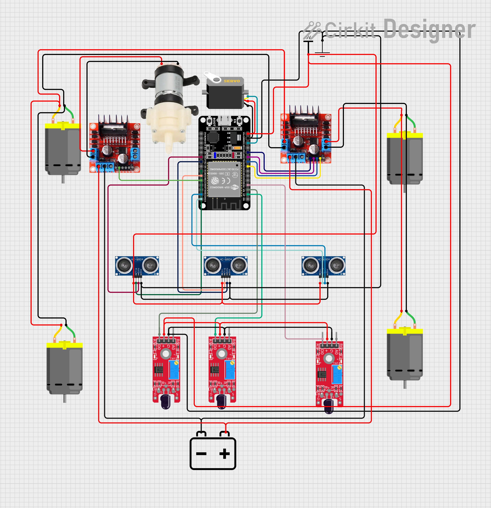
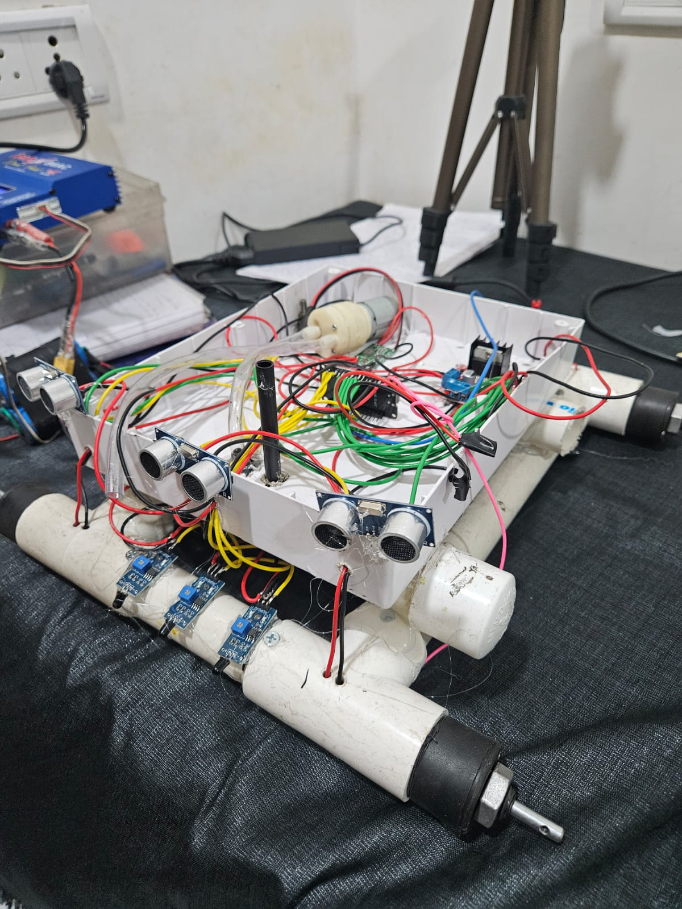

# 🔥 ESP32 Fire Fighting Robot

A WiFi-controlled **ESP32-based Fire Fighting Robot** capable of detecting fire, navigating obstacles, and extinguishing flames automatically or via manual control through a web browser.

---

## 🚀 Features

### 🔁 Auto Mode
- Obstacle avoidance using **3 ultrasonic sensors (Left, Front, Right)**
- Smart navigation logic
- Automatic fire detection and response

### 🎮 Manual Mode
- Control robot using mobile or laptop browser
- Forward / Backward / Left / Right / Stop

### 🔥 Fire Detection System
- 3 flame sensors (Left, Center, Right)
- Servo aligns towards fire direction
- Water pump activates automatically

### 🌐 WiFi Control
- ESP32 creates its own hotspot
- Control via browser (no app required)
- Simple and lightweight HTTP interface

---

## 🧠 System Architecture

    [ Mobile Browser ]
            ↓ HTTP
         ESP32 (WiFi AP)
            ↓
      ┌───────────────┐
      │ Control Logic │
      └───────────────┘
       ↓       ↓       ↓
    Motors  Sensors   Pump
             ↓
         Fire Detection

---

## 🛠️ Hardware Components

- ESP32 Devkit v1  
- L298N Motor Driver (2)  
- DC Motors (4)  
- Ultrasonic Sensors (HC-SR04) ×3  
- Flame Sensors ×3  
- Servo Motor (MG90S)  
- Water Pump + Driver/Relay  
- Battery Pack (Li-ion recommended)  
- Robot Chassis  

---

## 🔌 Circuit Diagram

---

## 🧩 Pin Configuration

### 🔧 Motor Driver

| Function | ESP32 Pin |
|----------|----------|
| IN1      | 14       |
| IN2      | 27       |
| IN3      | 26       |
| IN4      | 25       |
| ENA      | 32       |
| ENB      | 33       |

---

### 📏 Ultrasonic Sensors

| Sensor | TRIG | ECHO |
|--------|------|------|
| Left   | 18   | 16   |
| Front  | 19   | 17   |
| Right  | 23   | 22   |

---

### 🔥 Flame Sensors

| Position | ESP32 Pin |
|----------|----------|
| Left     | 39       |
| Center   | 36       |
| Right    | 34       |

---

### ⚙️ Actuators

| Device | ESP32 Pin |
|--------|----------|
| Servo  | 13       |
| Pump   | 21       |

---

## 📁 Project Structure

    ESP32-Fire-Robot/
    │
    ├── FireRobot.ino        # Main ESP32 code
    │
    ├── media/
    │   ├── FireFightingBotCircuit.png
    │   ├── FireFightingBot.jpeg
    │   ├── demo.gif
    │
    └── README.md

---

## ⚙️ Setup Instructions

### 1️⃣ Upload Code

- Open `FireRobot.ino` in Arduino IDE  
- Select ESP32 Dev Board  
- Install required libraries (WiFi, Servo)  
- Upload code  

---

### 2️⃣ Power the Robot

- Use battery pack (recommended)  
- Ensure common ground for all modules  

---

### 3️⃣ Connect to WiFi

SSID: ESP32_FIREBOT  
Password: 12345678  

---

### 4️⃣ Open Control Panel

Open browser and go to:

http://192.168.4.1

---

## 🎮 Controls

| Button | Action |
|--------|--------|
| Forward  | Move forward |
| Backward | Move backward |
| Left     | Turn left |
| Right    | Turn right |
| Stop     | Stop motors |
| Auto Mode   | Enable autonomous mode |
| Manual Mode | Enable manual control |

---

## 🧪 Working Principle

1. Robot moves using manual commands or auto mode  
2. Ultrasonic sensors continuously measure distances  
3. In auto mode:
   - Moves forward if path is clear  
   - Turns based on left/right distance comparison  
4. Flame sensors detect fire (active LOW)  
5. If fire is detected:
   - Robot stops  
   - Servo aligns towards fire  
   - Pump activates to extinguish  

---

## ⚠️ Important Notes

- Flame sensors output **LOW when fire is detected**  
- Ultrasonic sensors require stable power supply  
- Do NOT power motors directly from ESP32  
- Use proper motor driver (L298N recommended)  
- Ensure correct grounding across all modules  

---

## 🔮 Future Improvements

- Bluetooth / mobile app control  
- Camera-based fire detection  
- IoT dashboard (Django / React)  
- GPS-based navigation  
- Autonomous mapping system  

---

## 📸 Project Preview

### Robot

### Demo

---

## 📜 License

This project is open-source and available under the MIT License.

---

## 🙌 Acknowledgment

Built as a practical robotics project combining:
- Embedded systems  
- IoT  
- Automation  
- Fire safety applications  

---

⭐ If you like this project, consider giving it a star!